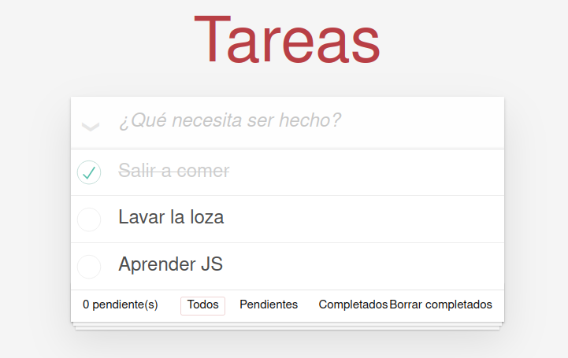

# ✔️ Todo-list
A simple Todo-List web app created as a learning project.




## Table of contents 📋
* [General info](#general-info)
* [Technologies](#technologies)
* [Setup](#setup)

## General info 📖
A simple Todo-List created as a learning project.<br>
Live version is available [here](https://mygeone.github.io/todo-list/)
	
## Technologies 🛠
This project is created with:
* NodeJS: 10.19

## Setup 🚀
To run this project, install it locally using npm:

```
$ npm install
$ npm run build
$ npm start
```

